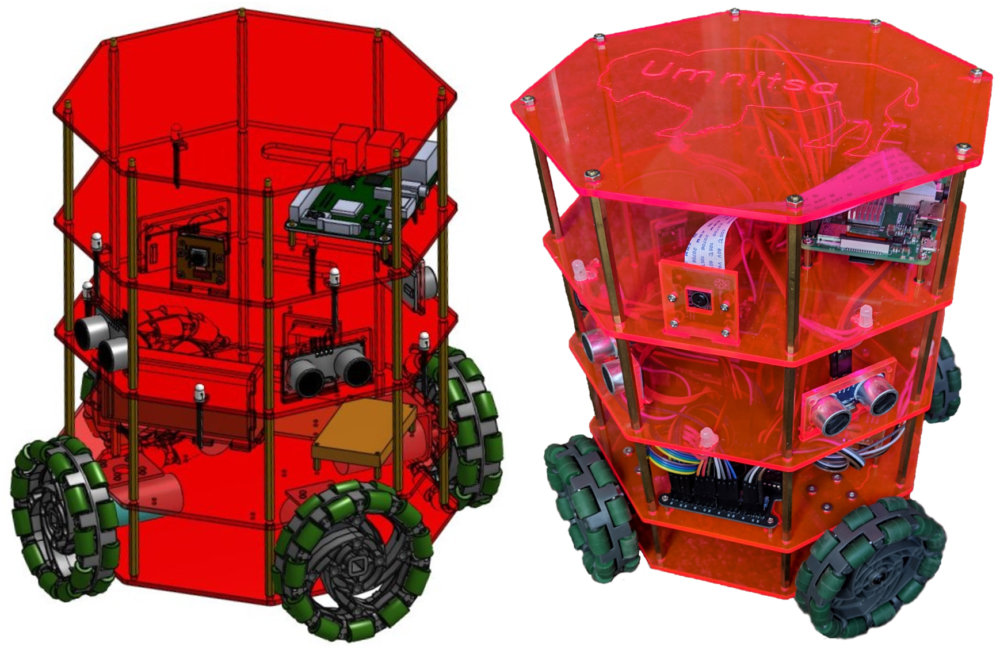

# umnitsa_mechanical

This package contains the necessary files to turn the design of the umnitsa robot into reality.

  <em>design into reality</em>
 

   
`/PCBDesigns` contains all the custom PCB designs that are used on the robot and includes it's own README.  

`/logos` contains umnitsa logos  

`/Drawings` contains all the .DXF files that are created from the OnShape models of [Umnitsa Pi](www.google.com) or [Umnitsa Nano](www.google.com).
